# 👋 Hi there, I'm Deepak Mandloi!

<div align="center">
  
</div>

<div align="center">
  
</div>

---

## 🎯 About Me

```python
class DeepakMandloi:
    def __init__(self):
        self.name = "Deepak Mandloi"
        self.role = "Data Science Enthusiast"
        self.location = "Bhopal, India"
        self.education = "B.Tech Computer Science (CGPA: 8.40)"
        
    def current_focus(self):
        return [
            "🔍 Exploring Deep Learning & Neural Networks",
            "📊 Building ML Models for Real-World Problems", 
            "🎨 Creating Data Visualizations",
            "🚀 Contributing to Open Source Projects"
        ]
    
    def tech_stack(self):
        return {
            "languages": ["Python", "SQL"],
            "ml_frameworks": ["Scikit-learn", "TensorFlow", "PyTorch"],
            "data_viz": ["Matplotlib", "Seaborn", "Power BI", "Tableau"],
            "databases": ["MySQL"],
            "tools": ["Jupyter", "VS Code", "Google Colab"]
        }
```

---

## 🛠️ Tech Stack & Tools

<div align="center">

### Languages & Frameworks


### Development Tools


### Data & Analytics


</div>

---

## 🚀 Featured Projects

<div align="center">

### 🏠 House Price Prediction
> ML model using Python & scikit-learn with regression techniques
> 
> 
> 

### 🚢 Titanic Survival Prediction  
> Built survival model using logistic regression & decision trees
>
> 
> 

### 🎥 Real-Time Motion Detection
> OpenCV-based motion detection with background subtraction
>
> 
> 

### 🏦 Bank Loan Analytics Dashboard
> Interactive Power BI dashboard with predictive analytics
>
> 
> 

</div>

---

## 📊 GitHub Stats

<div align="center">
  
  
</div>

<div align="center">
  
</div>

---

## 🏆 Achievements & Certifications

<div align="center">

| 🎓 Certification | 🏢 Provider | 📅 Date |
|---|---|---|
| 🥇 AMCAT Data Processing Specialist | AMCAT | Sep 2024 |
| 🐍 Complete Python For Data Science | LERN X | May 2024 |
| 📊 Data Analysis Using Python | IBM | Sep 2023 |
| 🏅 BCG X Data Science Job Simulation | BCG X (Forage) | Feb 2024 |
| 💻 Python & SQL | HackerRank | May 2024 |

</div>

---

## 🎯 Current Goals

```mermaid
graph LR
    A[🎯 2025 Goals] --> B[🤖 Master Deep Learning]
    A --> C[☁️ Cloud Platforms]
    A --> D[🚀 MLOps Pipeline]
    A --> E[📊 Advanced Analytics]
    
    B --> F[Neural Networks]
    B --> G[Computer Vision]
    
    C --> H[AWS/Azure]
    C --> I[Docker/K8s]
    
    D --> J[CI/CD for ML]
    D --> K[Model Deployment]
```

<div align="center">
  


</div>

---

## 🤝 Let's Connect!

<div align="center">
  <a href="mailto:deepakmandloi1706@gmail.com">
    
  </a>
  <a href="your-linkedin-url">
    
  </a>
  <a href="your-github-url">
    
  </a>
</div>

<div align="center">
  
</div>

---

<div align="center">
   
  <em><b>I love connecting with different people</b> so if you want to say <b>hi, I'll be happy to meet you more!</b> 😊</em>
</div>

<div align="center">
  
### 💭 Random Dev Quote
  


</div>

---

<div align="center">
  
</div>

<div align="center">
  
**⭐ Star some repositories if you find them interesting!**

</div>
